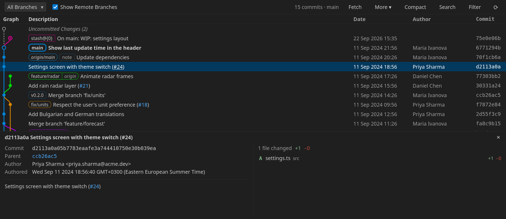
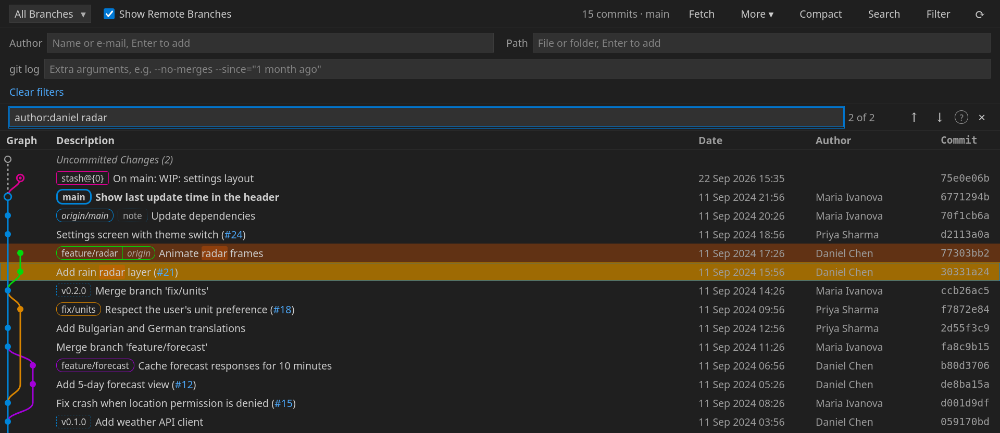
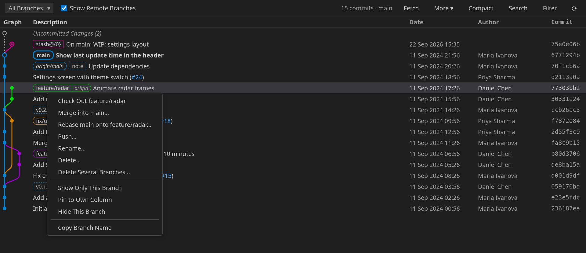

# Git Graph Next

A fast, interactive Git graph for VS Code: browse your repository's history, see what every commit changed, and branch, merge, rebase and more — right from the graph.



## Getting started

Open the graph from the **Git Graph Next** icon in the Activity Bar, the **Git Graph** item in the status bar, the Source Control title bar, or the command **Git Graph Next: View Git Graph**.

- **Click** a commit to see its details and changed files; click a file for its diff.
- **Right-click** a commit, a branch, a tag or a stash for everything you can do with it.
- **Ctrl/Cmd+click** or **Shift+click** to select several commits — two selected commits are compared.
- **Double-click** a branch label to check it out.
- **Ctrl/Cmd+F** to search.

## Features

### A graph that stays readable

- Branch, remote-branch and tag labels. A local branch and its remote copy at the same commit share one label.
- The Uncommitted Changes row and your stashes appear in the graph.
- **Pin** long-lived branches like `main` or `develop` to a column of their own, drawn as a straight line.
- Give branches **fixed colours**, and optionally show each commit's branch colour on its row.
- **Compact** mode folds long stretches of linear history into single rows, so the branching structure fits on one screen.
- Issue references such as `#123` become links — automatically for GitHub and GitLab, and through your own rules for Jira or anything else.
- Git notes are marked on commits and shown in their details.

### Search and filter



- Search with operators: `author:alice`, `message:"null check"`, `tag:v1`, `after:2024-01-01`, `date:>=2024-03-15`, and more. Press the **?** in the search bar for the full list.
- A match further back than what is loaded? **Search older commits** finds it and loads the graph up to it.
- Filter the graph by **branches and tags**, **author**, **file or folder**, or any extra **`git log` arguments** (`--no-merges`, `--since=…`).
- **Hide** branches and tags by pattern (`dependabot/*`, `nightly-*`).
- **View File History** from the Explorer or the editor: the graph filtered to one file, followed across renames.

### Act on it



- **Branches**: check out, create, rename, delete (also on the remote), delete several at once, merge, rebase, push, pull.
- **Commits**: cherry-pick, revert, reset, create a branch or tag, check out.
- **Several commits**: cherry-pick, revert, squash or drop them together.
- **Interactive rebase** in a normal VS Code editor: reorder the list, change `pick` to `reword`, `squash`, `fixup`, `edit` or `drop`, then **Start Rebase**.
- **Fixup commits** and **autosquash**, straight from the commit you want to fix.
- **Stashes**: apply, pop, drop, or turn into a branch.
- **Patches**: create them from commits or uncommitted changes, and apply them to the working tree or as commits.
- When a merge, rebase, cherry-pick or revert stops at a conflict, a banner offers **Continue** and **Abort**.

Every action shows exactly what it will do before it runs, and destructive ones are marked as such. When git needs a password it cannot ask for here, you are offered to run the same command in a terminal.

## Settings

All settings are under **Git Graph Next** in the Settings editor. The ones most worth knowing:

| Setting | What it does |
|---|---|
| `git-graph-next.graph.pinnedBranches` | Branches drawn as a straight line in their own column, e.g. `["main", "develop"]`. |
| `git-graph-next.graph.branchColours` | Fixed colours, e.g. `{ "main": "#e5484d", "release/*": "#f5a524" }`. |
| `git-graph-next.graph.colourCommitRows` | Show each commit's branch colour on its row. |
| `git-graph-next.excludeBranches` | Branches and tags to hide, as `git log --exclude` patterns. |
| `git-graph-next.extraLogArguments` | Extra arguments for `git log`, e.g. `["--no-merges"]`. |
| `git-graph-next.issueLinking.rules` | Your own issue links, e.g. `{ "pattern": "([A-Z]+-\\d+)", "url": "https://jira.example.com/browse/$1" }`. |
| `git-graph-next.maxCommits` | How many commits load at first (more load as you scroll). |
| `git-graph-next.commitOrdering` | `date`, `author-date` or `topological`. |
| `git-graph-next.repository.sign.commits` / `.sign.tags` | Sign what the graph creates. |

## Performance

Tested on a repository with 100,000 commits and 20,000 branches: laying out all 100,000 commits takes under a tenth of a second, and scrolling costs the same at any size. Most of the time goes into `git log` itself, which is much faster when the repository has a *commit-graph* file. Recent versions of git write one during `git gc`; you can also write it yourself:

```sh
git commit-graph write --reachable
```

## Requirements

- Git 2.17 or later on your `PATH`, or set in `git-graph-next.git.path` (or VS Code's `git.path`).
- VS Code 1.85 or later. Only public VS Code APIs are used, so VSCodium and remote windows (SSH, containers, WSL) are supported too.
- Git Graph Next runs git in your workspace, so it is disabled in untrusted workspaces.

## Privacy

Git Graph Next collects no data and sends nothing anywhere. It talks to the network only when you fetch, pull or push, through your own git.

## About

Git Graph Next is an independent, clean-room project under the MIT licence. It is not a fork of, and not affiliated with, the Git Graph extension by mhutchie; no code from that project was used. See [NOTICE.md](NOTICE.md).
